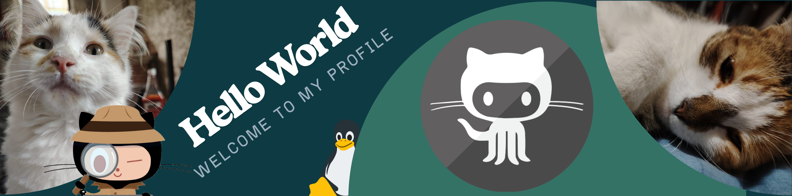
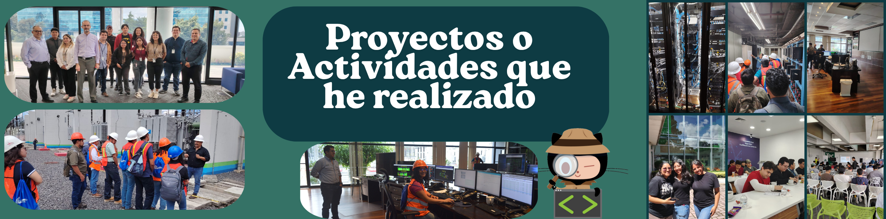
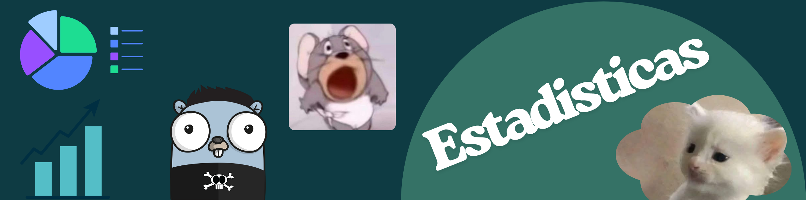
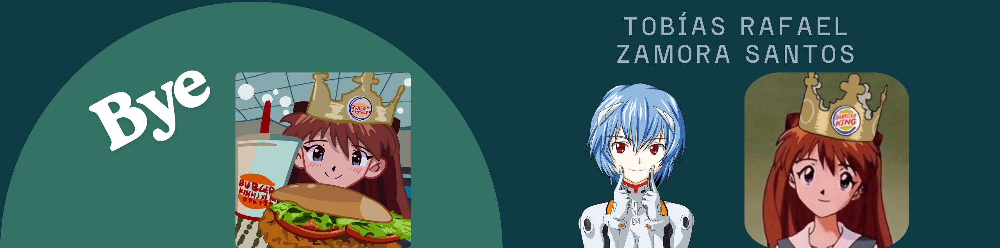

<!--Banner-->

<!-- PERFIL README - Tobías Rafael Zamora Santos -->

  

  
  
  
  <!--  -->

---

Soy **Tobías Rafael Zamora Santos**, estudiante de **Ingeniería en Ciencias y Sistemas (USAC)**. Me apasiona **aprender cosas nuevas** y construir soluciones que mezclan **desarrollo web**, **DevOps/Cloud** y **backend**. Disfruto colaborar en equipos donde pueda **aprender de otros** y compartir lo que sé.

- 🔭 Actualmente: proyectos académicos y personales con **React**, **Node.js**, **Go**, **Docker** y **AWS/Azure/GCP**.
- 🌱 Aprendiendo: **Kubernetes**, **microservicios gRPC**, **ARM asm/codegen**.
- 🤝 Busco colaborar en: proyectos open‑source de **backend**, **infraestructura** y **visualización de datos**.
- 💬 Pregúntame sobre: **React**, **APIs con Node/Express**, **contenedores** y **Bases de datos**.
- ⚡ Fun fact: en mis ratos libres veo **series**.

---

**Lenguajes:**

  

**Frontend:**

  

**Backend & Datos:**

  

**DevOps & Cloud:**

  

**Plataformas**

  

**Editores o IDES**

  

**Otras herramientas/tecnologias utilizadas**

  

---

- **Lenguaje con ANTLR + Go**: funciones, slices, `break/continue`, y **codegen a ARM**.
- **Laboratorios de Redes Cisco**: VLANs, OSPF/EIGRP/BGP, HSRP, STP, LACP y seguridad de switches.
- **Dashboards y Analítica**: **Grafana** con **MySQL/Valkey**, series temporales y KPIs.
- **En 2025** fui parte del comite organizador de **COECYS 2025** en el puesto de encargado de **Visitas Técnicas**.

---

  
  

  

---

-  `rafa0410`
-  _r.zamorasantos@gmail.com_
-  _https://github.com/rafa-04102000_

---

  

